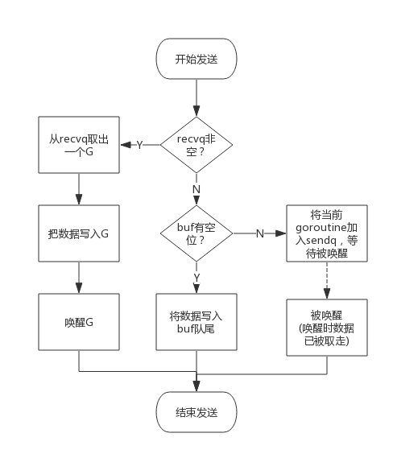

[笔记]go源码笔记

### 前言：目录结构使用[go专家编程](https://rainbowmango.gitbook.io/go)，大部分源码分析参考[Go语言设计与实现](https://draveness.me/golang/)

## 第一章 常见数据结构实现原理
### 1.1 chan
#### 数据结构

```go
type hchan struct {
	qcount   uint           // total data in the queue 当前元素的个数
	dataqsiz uint           // size of the circular queue 环形队列的大小
	buf      unsafe.Pointer // points to an array of dataqsiz elements
	elemsize uint16  // 单个元素大小
	closed   uint32 // 关闭标识
	elemtype *_type // element type 元素类型
	sendx    uint   // send index 元素写入位置
	recvx    uint   // receive index 元素读取位置
	recvq    waitq  // list of recv waiters 阻塞的等待读消息的Goroutine列表，使用双向链表waitq表示
	sendq    waitq  // list of send waiters
	lock mutex // 互斥锁，不可以并发读写
}

```
- 示例:make(chan int, 6)


#### 创建
```go
func makechan(t *chantype, size int) *hchan {
	elem := t.elem
	switch {
	case mem == 0:
		// Queue or element size is zero.
		c = (*hchan)(mallocgc(hchanSize, nil, true))
		// Race detector uses this location for synchronization.
		c.buf = c.raceaddr()
	case elem.ptrdata == 0:
		// Elements do not contain pointers.
		// Allocate hchan and buf in one call.
		c = (*hchan)(mallocgc(hchanSize+mem, nil, true))
		c.buf = add(unsafe.Pointer(c), hchanSize)
	default:
		// Elements contain pointers.
		c = new(hchan)
		c.buf = mallocgc(mem, elem, true)
	}
	c.elemsize = uint16(elem.size)
	c.elemtype = elem
	c.dataqsiz = uint(size)
	return c
}
```
如果channel不存在缓冲区，则只会hchan分配一段内存，如果元素类型不是指正类型，
就会为hchan和底层数组分配一块连续的内存空间，否则单独为hchan和缓冲区分配内存

#### 发送数据


- 当存在等待的接受者时，直接发送, 调用send.Direct将数据拷贝到dst,然后将接收数据的goroutine标记为可运行状态
```go
if sg := c.recvq.dequeue();sg != nil {
    send(c, sg, ep, func(unlock(&c.lock)), 3)
    return true
}

func send(c *hchan, sg *sudog, ep unsafe.Pointer, unlockf func(), skip int) {
	if sg.elem != nil {
		sendDirect(c.elemtype, sg, ep)
		sg.elem = nil
	}
	gp := sg.g
	unlockf()
	gp.param = unsafe.Pointer(sg)
	if sg.releasetime != 0 {
		sg.releasetime = cputicks()
	}
	goready(gp, skip+1)
}
```
- 如果有缓冲区没有满，通过typedmemmove拷贝数据到缓冲区，并更新索引
```go
	if c.qcount < c.dataqsiz {
		// Space is available in the channel buffer. Enqueue the element to send.
		qp := chanbuf(c, c.sendx)
		typedmemmove(c.elemtype, qp, ep)
		c.sendx++
		if c.sendx == c.dataqsiz {
			c.sendx = 0
		}
		c.qcount++
		unlock(&c.lock)
		return true
	}
```
- 否则阻塞式发送: 获取当前goroutine；获取sudog,并设置阻塞相关的信息，加入发送队列；
调用goparkunlock将当前goroutine陷入沉睡等待唤醒；唤醒后收尾
```go
	// Block on the channel. Some receiver will complete our operation for us.
	gp := getg()
	mysg := acquireSudog()
	mysg.elem = ep
	mysg.g = gp
	mysg.isSelect = false
	mysg.c = c
	gp.waiting = mysg
	c.sendq.enqueue(mysg)

	gopark(chanparkcommit, unsafe.Pointer(&c.lock), waitReasonChanSend, traceEvGoBlockSend, 2)
	gp.waiting = nil
	gp.param = nil
	releaseSudog(mysg)
	return true
```
#### 接收数据


- 空channel调用gopark使当前goroutine直接进入waiting list
```go
func chanrecv(c *hchan, ep unsafe.Pointer, block bool) (selected, received bool) {
	// raceenabled: don't need to check ep, as it is always on the stack
	// or is new memory allocated by reflect.

	if c == nil {
		if !block {
			return
		}
		gopark(nil, nil, waitReasonChanReceiveNilChan, traceEvGoStop, 2)
	}


```

- 存在等待的sender时，直接从sender或缓冲区获取数据，并唤醒第一个sendq的goroutine
```go
	if sg := c.sendq.dequeue(); sg != nil {
		// Found a waiting sender. If buffer is size 0, receive value
		// directly from sender. Otherwise, receive from head of queue
		// and add sender's value to the tail of the queue (both map to
		// the same buffer slot because the queue is full).
		recv(c, sg, ep, func() { unlock(&c.lock) }, 3)
		return true, true
	}

func recv(c *hchan, sg *sudog, ep unsafe.Pointer, unlockf func(), skip int) {
	if c.dataqsiz == 0 {
		if ep != nil {
			// copy data from sender
			recvDirect(c.elemtype, sg, ep)
		}
	} else {
		qp := chanbuf(c, c.recvx)
		// copy data from queue to receiver
		if ep != nil {
			typedmemmove(c.elemtype, ep, qp)
		}
		// copy data from sender to queue
		typedmemmove(c.elemtype, qp, sg.elem)
		c.recvx++
		if c.recvx == c.dataqsiz {
			c.recvx = 0
		}
		c.sendx = c.recvx // c.sendx = (c.sendx+1) % c.dataqsiz
	}
	sg.elem = nil
	gp := sg.g
	unlockf()
	gp.param = unsafe.Pointer(sg)
	goready(gp, skip+1)

```
- 缓冲区存在数据时从缓冲区获取数据
```go
	if c.qcount > 0 {
		// Receive directly from queue
		qp := chanbuf(c, c.recvx)
		if ep != nil {
			typedmemmove(c.elemtype, ep, qp)
		}
		typedmemclr(c.elemtype, qp)
		c.recvx++
		if c.recvx == c.dataqsiz {
			c.recvx = 0
		}
		c.qcount--
		unlock(&c.lock)
		return true, true
	}
```
- 等待其他goroutine发送数据
```go
	// no sender available: block on this channel.
	gp := getg()
	mysg := acquireSudog()
	// No stack splits between assigning elem and enqueuing mysg
	// on gp.waiting where copystack can find it.
	mysg.elem = ep
	mysg.waitlink = nil
	gp.waiting = mysg
	mysg.g = gp
	mysg.isSelect = false
	mysg.c = c
	gp.param = nil
	c.recvq.enqueue(mysg)
	gopark(chanparkcommit, unsafe.Pointer(&c.lock), waitReasonChanReceive, traceEvGoBlockRecv, 2)

	gp.waiting = nil
	gp.activeStackChans = false
	if mysg.releasetime > 0 {
		blockevent(mysg.releasetime-t0, 2)
	}
	closed := gp.param == nil
	gp.param = nil
	mysg.c = nil
	releaseSudog(mysg)
	return true, !closed

```

#### 关闭
- 关闭nil chan会panic
- 关闭已经closed的chan会panic
- 将recvq和sendq中的G唤醒
```go
	var glist gList

	// release all readers
	for {
		sg := c.recvq.dequeue()
		if sg == nil {
			break
		}
		if sg.elem != nil {
			typedmemclr(c.elemtype, sg.elem)
			sg.elem = nil
		}
		if sg.releasetime != 0 {
			sg.releasetime = cputicks()
		}
		gp := sg.g
		gp.param = nil
		if raceenabled {
			raceacquireg(gp, c.raceaddr())
		}
		glist.push(gp)
	}

	// release all writers (they will panic)
	for {
		sg := c.sendq.dequeue()
		if sg == nil {
			break
		}
		sg.elem = nil
		if sg.releasetime != 0 {
			sg.releasetime = cputicks()
		}
		gp := sg.g
		gp.param = nil
		if raceenabled {
			raceacquireg(gp, c.raceaddr())
		}
		glist.push(gp)
	}
	unlock(&c.lock)

	// Ready all Gs now that we've dropped the channel lock.
	for !glist.empty() {
		gp := glist.pop()
		gp.schedlink = 0
		goready(gp, 3)
```

### 1.2 array
特性：同一种元素类型`Elem`，长度固定`bound`，连续内存

#### 数据结构
```go
type Array struct {
	Elem  *Type // element type
	Bound int64 // number of elements; <0 if unknown yet
}
```
#### 初始化
- 如果长度<=4, 会直接在栈上初始化
- 否则会在静态存储区初始化然后拷贝到栈上

### 1.3 slice
#### 数据结构
- 编译时态
```go
type Slice struct {
	Elem *Type // element type
}
```
- 运行时态
```go
type slice struct {
	array unsafe.Pointer
	len   int
	cap   int
}
```
#### 初始化
##### 切片方式创建

中间代码
```go
func newSlice() []int {
	arr := [3]int{1, 2, 3}
	slice := arr[0:1]
	return slice
}

// GOSSAFUNC=newSlice 
v27 (+5) = SliceMake <[]int> v11 v14 v17

name &arr[*[3]int]: v11
name slice.ptr[*int]: v11
name slice.len[int]: v14
name slice.cap[int]: v17
```
##### 字面量方式创建
```go
slice := []int{1, 2, 3}

// slicelit
func slicelit(ctxt initContext, n *Node, var_ *Node, init *Nodes) {
    var vstat [3]int
    vstat[0] = 1
    vstat[1] = 2
    vstat[2] = 3
    var vauto *[3]int = new([3]int)
    *vauto = vstat
    slice := vauto[:]
}
```
##### 使用make创建

- 当切片非常小时(`isSmallMakeSlice`)，会在编译时期完成
```go
slice := make([]int, 3, 4)
// 转换为
var arr [4]int
slice := arr[:3] 
```
- 运行时创建
```go
func makeslice(et *_type, len, cap int) unsafe.Pointer {
	mem, overflow := math.MulUintptr(et.size, uintptr(cap))
	if overflow || mem > maxAlloc || len < 0 || len > cap {
		mem, overflow := math.MulUintptr(et.size, uintptr(len))
		if overflow || mem > maxAlloc || len < 0 {
			panicmakeslicelen()
		}
		panicmakeslicecap()
	}

	return mallocgc(mem, et, true)
}
```
#### append
- 如果容量不够会扩容，底层指向的数组发生改变

#### 扩容
```go
func growslice(et *_type, old slice, cap int) slice {
	newcap := old.cap
	doublecap := newcap + newcap
	if cap > doublecap {
		newcap = cap
	} else {
		if old.len < 1024 {
			newcap = doublecap
		} else {
			for 0 < newcap && newcap < cap {
				newcap += newcap / 4
			}
			if newcap <= 0 {
				newcap = cap
			}
		}
	}
```
- 容量计算
    - 如果期望容量大于当前容量的2倍，用期望容量
    - 如果当前容量<1024，用当前容量的2倍
    - 否则依次依次增加1/4，直到新容量>=期望容量
- 内存对齐
```go
	capmem = roundupsize(capmem)
	newcap = int(capmem / et.size)
```
    - 可选内存大小可见`runtime/sizeclasses.go`
    - [内存对齐参考](https://ms2008.github.io/2019/08/01/golang-memory-alignment/)
    
### 1.3 map
#### 数据结构
```go
const bucketCnt = 8

// A bucket for a Go map.
type bmap struct {
	tophash [bucketCnt]uint8 // 存储hash值得高8位，可以减少键值对的访问次数
}

// mapextra holds fields that are not present on all maps.
type mapextra struct {
	overflow    *[]*bmap //溢出桶，和正常桶在内存中是连续的，能减少扩容的频率
	oldoverflow *[]*bmap

	// nextOverflow holds a pointer to a free overflow bucket.
	nextOverflow *bmap
}

type hmap struct {
    count int   // 元素数量
    flags unit8 
    B uint8  // bucket数量的对数,即len(buckets) == 2^B
    noverflow uinit16
    hash0 uint32  // 哈希随机性种子，创建时确定
    
    buckets usage.Pointer
    oldbuckets usage.Pointer // 扩容时用于保存之前的buckets
    nevacuate uintptr
    
    extra *mapextra
}
```

bmap会根据键值对的类型在编译时进行推导重建
```go
type bmap struct {
    topbits [8]uint8
    keys [8]keytype
    values [8]valuetype
    pad uintptr
    overflow uintptr
```
整体数据结构展示如下


负载因子loadFactor = count / B, go在负载因子大于6.5时触发rehash

#### 查找
 1. 根据key值算出哈希值 
 2. 取哈希值低位与hmap.B取模确定bucket位置 
 3. 取哈希值高位在tophash数组中查询 
 4. 如果tophash[i]中存储值也哈希值相等，则去找到该bucket中的key值进行比较 
 5. 当前bucket没有找到，则继续从下个overflow的bucket中查找。 
 6. 如果当前处于搬迁过程，则优先从oldbuckets查找
```go
func mapaccess1(t *maptype, h *hmap, key unsafe.Pointer) unsafe.Pointer {
	if h == nil || h.count == 0 {
		if t.hashMightPanic() {
			t.hasher(key, 0) // see issue 23734
		}
		return unsafe.Pointer(&zeroVal[0])
	}
	hash := t.hasher(key, uintptr(h.hash0)) // 哈希值
	m := bucketMask(h.B) // 1<<B - 1。 hash&m按位与（即hash的后2^B位）找到桶的位置
	b := (*bmap)(add(h.buckets, (hash&m)*uintptr(t.bucketsize)))
	if c := h.oldbuckets; c != nil {
		oldb := (*bmap)(add(c, (hash&m)*uintptr(t.bucketsize)))
		if !evacuated(oldb) {
			b = oldb // 优先旧桶
		}
	}
	top := tophash(hash) // hash >> 56
bucketloop:
	for ; b != nil; b = b.overflow(t) {
		for i := uintptr(0); i < bucketCnt; i++ {
            // 先比较tophash
			if b.tophash[i] != top {
				continue
			}
			k := add(unsafe.Pointer(b), dataOffset+i*uintptr(t.keysize))
			if t.indirectkey() {
				k = *((*unsafe.Pointer)(k))
			}
            // 比较真正的key
			if t.key.equal(key, k) {
				e := add(unsafe.Pointer(b), dataOffset+bucketCnt*uintptr(t.keysize)+i*uintptr(t.elemsize))
				if t.indirectelem() {
					e = *((*unsafe.Pointer)(e))
				}
				return e
			}
		}
	}
	return unsafe.Pointer(&zeroVal[0])
}
```
#### 写入

```go
func mapassign(t *maptype, h *hmap, key unsafe.Pointer) unsafe.Pointer {
	hash := t.hasher(key, uintptr(h.hash0))
again:
    // 找到对应的桶
	bucket := hash & bucketMask(h.B)
	b := (*bmap)(unsafe.Pointer(uintptr(h.buckets) + bucket*uintptr(t.bucketsize)))
	top := tophash(hash)

	var inserti *uint8
	var insertk unsafe.Pointer
	var elem unsafe.Pointer
bucketloop:
	for {
		for i := uintptr(0); i < bucketCnt; i++ {
			if b.tophash[i] != top {
				if isEmpty(b.tophash[i]) && inserti == nil {
					inserti = &b.tophash[i]
					insertk = add(unsafe.Pointer(b), dataOffset+i*uintptr(t.keysize))
					elem = add(unsafe.Pointer(b), dataOffset+bucketCnt*uintptr(t.keysize)+i*uintptr(t.elemsize))
				}
				if b.tophash[i] == emptyRest {
					break bucketloop
				}
				continue
			}
			k := add(unsafe.Pointer(b), dataOffset+i*uintptr(t.keysize))
			if t.indirectkey() {
				k = *((*unsafe.Pointer)(k))
			}
			if !t.key.equal(key, k) {
				continue
			}
			elem = add(unsafe.Pointer(b), dataOffset+bucketCnt*uintptr(t.keysize)+i*uintptr(t.elemsize))
			goto done
		}
		ovf := b.overflow(t)
		if ovf == nil {
			break
		}
        // 在溢出桶接着找
		b = ovf
	}
    
    // 全部都满了，新建一个溢出桶
	if inserti == nil {
		// all current buckets are full, allocate a new one.
		newb := h.newoverflow(t, b)
		inserti = &newb.tophash[0]
		insertk = add(unsafe.Pointer(newb), dataOffset)
		elem = add(insertk, bucketCnt*uintptr(t.keysize))
	}

	// store new key/elem at insert position
	if t.indirectkey() {
		kmem := newobject(t.key)
		*(*unsafe.Pointer)(insertk) = kmem
		insertk = kmem
	}
	if t.indirectelem() {
		vmem := newobject(t.elem)
		*(*unsafe.Pointer)(elem) = vmem
	}
	typedmemmove(t.key, insertk, key)
	*inserti = top
    // 更新数量
	h.count++

done:
	if t.indirectelem() {
		elem = *((*unsafe.Pointer)(elem))
	}
	return elem
}
```
####  扩容

前提条件：1. 负载因子>6.5; 2. overflow bucket数量> 2^15

扩容入口
```go
func hashGrow(t *maptype, h *hmap) {
	bigger := uint8(1)
    
    // 判断是否等量扩容
	if !overLoadFactor(h.count+1, h.B) {
		bigger = 0
		h.flags |= sameSizeGrow
	}
	oldbuckets := h.buckets
    // 新建正常桶和溢出桶, 如果增量扩容，即buckets数量翻倍
	newbuckets, nextOverflow := makeBucketArray(t, h.B+bigger, nil)

	h.B += bigger
	h.flags = flags
	h.oldbuckets = oldbuckets
	h.buckets = newbuckets  //指向新桶
	h.nevacuate = 0
	h.noverflow = 0

    h.extra.oldoverflow = h.extra.overflow
    h.extra.overflow = nil
    h.extra.nextOverflow = nextOverflow
	}

}
```
扩容
```go
func evacuate(t *maptype, h *hmap, oldbucket uintptr) {
	b := (*bmap)(add(h.oldbuckets, oldbucket*uintptr(t.bucketsize)))
	newbit := h.noldbuckets()
	if !evacuated(b) {
		var xy [2]evacDst
		x := &xy[0]
		x.b = (*bmap)(add(h.buckets, oldbucket*uintptr(t.bucketsize)))
		x.k = add(unsafe.Pointer(x.b), dataOffset)
		x.e = add(x.k, bucketCnt*uintptr(t.keysize))

		if !h.sameSizeGrow() {
			// 如果增量扩容，可能落在oldbucket+newbit的位置
		    
			y := &xy[1]
			y.b = (*bmap)(add(h.buckets, (oldbucket+newbit)*uintptr(t.bucketsize)))
			y.k = add(unsafe.Pointer(y.b), dataOffset)
			y.e = add(y.k, bucketCnt*uintptr(t.keysize))
		}
		for ; b != nil; b = b.overflow(t) {
			k := add(unsafe.Pointer(b), dataOffset)
			e := add(k, bucketCnt*uintptr(t.keysize))
			for i := 0; i < bucketCnt; i, k, e = i+1, add(k, uintptr(t.keysize)), add(e, uintptr(t.elemsize)) {
				top := b.tophash[i]
				if isEmpty(top) {
					b.tophash[i] = evacuatedEmpty
					continue
				}
				if top < minTopHash {
					throw("bad map state")
				}
				k2 := k
                // 如果key是指针类型
				if t.indirectkey() {
					k2 = *((*unsafe.Pointer)(k2))
				}
				var useY uint8 // 默认使用x

				if !h.sameSizeGrow() {
					hash := t.hasher(k2, uintptr(h.hash0))
					if h.flags&iterator != 0 && !t.reflexivekey() && !t.key.equal(k2, k2) {
						useY = top & 1
						top = tophash(hash)
					} else {
						if hash&newbit != 0 {
							useY = 1
						}
					}
				}

				b.tophash[i] = evacuatedX + useY // evacuatedX + 1 == evacuatedY
				dst := &xy[useY]                 // evacuation destination

				if dst.i == bucketCnt {
                    // 新建一个溢出桶
					dst.b = h.newoverflow(t, dst.b)
					dst.i = 0
					dst.k = add(unsafe.Pointer(dst.b), dataOffset)
					dst.e = add(dst.k, bucketCnt*uintptr(t.keysize))
				}
				dst.b.tophash[dst.i&(bucketCnt-1)] = top // mask dst.i as an optimization, to avoid a bounds check
				if t.indirectkey() {
					*(*unsafe.Pointer)(dst.k) = k2 // copy pointer
				} else {
					typedmemmove(t.key, dst.k, k) // copy elem
				}
				if t.indirectelem() {
					*(*unsafe.Pointer)(dst.e) = *(*unsafe.Pointer)(e)
				} else {
					typedmemmove(t.elem, dst.e, e)
				}
				dst.i++
				// These updates might push these pointers past the end of the
				// key or elem arrays.  That's ok, as we have the overflow pointer
				// at the end of the bucket to protect against pointing past the
				// end of the bucket.
				dst.k = add(dst.k, uintptr(t.keysize))
				dst.e = add(dst.e, uintptr(t.elemsize))
			}
		}
		// Unlink the overflow buckets & clear key/elem to help GC.
		if h.flags&oldIterator == 0 && t.bucket.ptrdata != 0 {
			b := add(h.oldbuckets, oldbucket*uintptr(t.bucketsize))
			// Preserve b.tophash because the evacuation
			// state is maintained there.
			ptr := add(b, dataOffset)
			n := uintptr(t.bucketsize) - dataOffset
			memclrHasPointers(ptr, n)
		}
	}

	if oldbucket == h.nevacuate {
		advanceEvacuationMark(h, t, newbit)
	}

}

```
#### 参考

## 第二章 常见控制结构实现原理

## 第三章 协程

## 第四章 内存管理

## 第五章 并发控制
## 第六章 反射

## 第七章 测试

## 第八章 http测试

## 第九章 定时器

## 第十章 语法糖

## 第十一章 go语言版本管理

## 第十二章 go依赖管理

## 附录1 编程陷阱


## 参考引用

- [Go专家编程](https://rainbowmango.gitbook.io/go)
- [Go设计与实现](https://draveness.me/golang/)
- [深度解密Go语言之 map](https://zhuanlan.zhihu.com/p/66676224)
